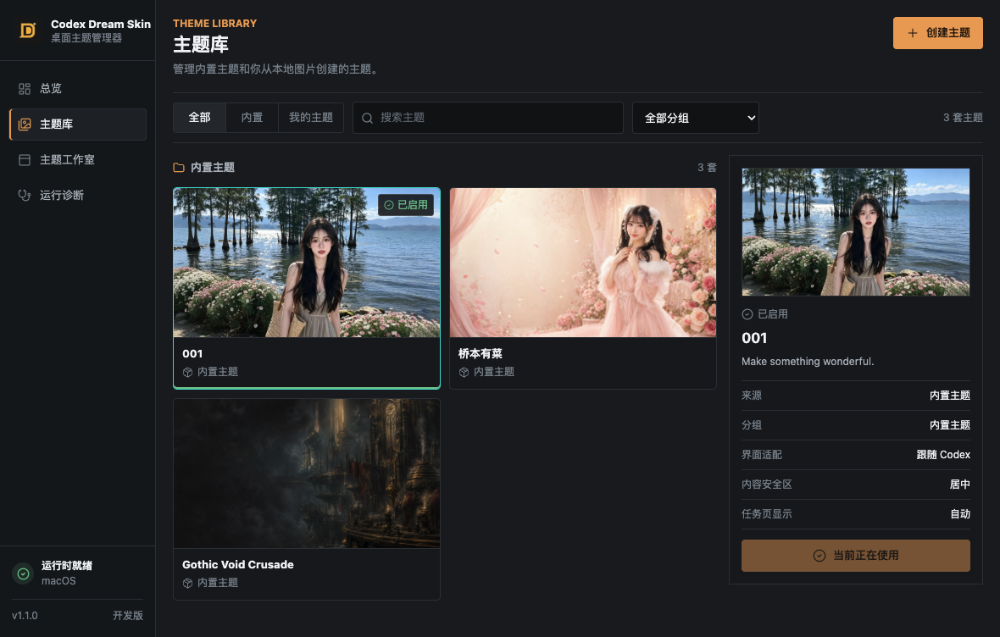

# Codex Dream Skin Manager

<p align="center">
  <strong>中文</strong> · <a href="./README.en.md">English</a>
</p>

<p align="center">
  <strong>面向 macOS 与 Windows 的 Codex 桌面换肤管理器。</strong><br>
  主题库 · 主题工作室 · 分组管理 · 实时切换 · 运行诊断
</p>

<p align="center">
  <a href="https://github.com/LiamTaan/codex-dream/releases/latest">下载最新版本</a>
  · <a href="https://github.com/Fei-Away/Codex-Dream-Skin">上游开源底座</a>
  · <a href="./LICENSE">MIT License</a>
</p>

> 非 OpenAI 官方产品。本项目不修改 Codex 官方 `.app`、`app.asar` 或 WindowsApps 文件。

<p align="center">
  
</p>

## 项目定位

这个仓库现在提供的是一套完整的跨平台桌面应用，而不只是换肤脚本：

- 在统一桌面界面中安装、启动、暂停和恢复换肤运行时；
- 浏览内置主题和个人主题，并按名称、来源与分组筛选；
- 从本地图片创建主题，设置名称、分组、明暗适配、焦点和任务页模式；
- 重命名、分组和删除个人主题；
- 在 Codex 已运行时热更新主题，通常不需要反复重启 Codex；
- 查看运行状态、CDP 端口和诊断信息；
- 同一套 Electron 控制面板支持 macOS 与 Windows。

## 开源底座与二次开发说明

本项目基于 [Fei-Away/Codex-Dream-Skin](https://github.com/Fei-Away/Codex-Dream-Skin) 开源项目进行二次开发。

上游项目提供了 Codex 换肤的核心基础，包括 macOS / Windows 平台脚本、本机 CDP 注入、主题运行时、恢复机制以及基础预设体系。本仓库在保留和继续维护这些能力的基础上，重点增加了：

- macOS / Windows 共用的 Electron 桌面管理端；
- 主题库、主题工作室、自定义名称与主题分组；
- 图片焦点、安全区和任务页显示设置；
- 开发态源码运行、运行时安装与跨平台操作桥接；
- 侧栏、设置页、菜单、输入区等更多原生界面的主题覆盖；
- Observer 限流、缓存边界、资源释放和长期运行内存优化；
- 桌面安装包与 GitHub Actions 跨平台发布流程。

感谢上游维护者和贡献者公开核心换肤实现。本仓库不是对上游来源的替代或抹除；衍生代码继续遵循上游 MIT 许可要求，详见 [LICENSE](./LICENSE)、[THIRD_PARTY_NOTICES.md](./THIRD_PARTY_NOTICES.md) 和 [macos/NOTICE.md](./macos/NOTICE.md)。

## v1.1.2 主要更新

- 新版桌面端会比对内置运行时与已安装版本，旧版、覆盖安装和重新下载后会明确引导更新；
- macOS 安装器会在替换运行时目录前安全停止旧注入器，修复 PID/launchd 交接竞争；
- 修复 Codex 内“正在应用皮肤”状态可能长时间不消失的问题；
- 错误通知新增手动关闭、12 秒自动过期，后续操作成功后会清除旧错误；
- 运行诊断现在会真实校验 CDP，并明确标注 `127.0.0.1` 为本机安全回环地址。

## v1.1.1 主要更新

- 修复 macOS 安装包缺少完整应用包签名、下载后被 Gatekeeper 误报为“应用已损坏”的问题；
- 发布流程现在会挂载 arm64 和 x64 DMG，对内部 `.app` 执行严格签名、Bundle ID 与架构校验；
- 当前使用完整 ad-hoc bundle 签名，不等同于 Apple Developer ID 签名或 Apple 公证。

## v1.1.0 主要更新

- 重新设计桌面端主题库、主题工作室和运行诊断界面；
- 新增主题重命名、自定义分组、分组筛选和个人主题删除；
- 新增图片焦点 X/Y 调整与跨页面背景适配；
- 改进侧栏、设置页、弹出菜单和状态图标的主题效果；
- 优化 macOS / Windows 注入观察器，降低长期运行的内存与 GC 压力；
- 避免主题库周期刷新时重复重建图片 DOM；
- 新增内置主题 `001`，当前共提供三套内置主题；
- 完善 macOS 与 Windows 的主题播种、图片格式识别和自动化测试。

## 下载安装

从 [GitHub Releases](https://github.com/LiamTaan/codex-dream/releases/latest) 下载当前平台的安装包：

- macOS Apple Silicon：下载文件名带 `arm64` 的 `.dmg`；
- macOS Intel：下载对应 x64 `.dmg`；
- Windows：下载 `.exe` 安装程序。

首次启动后：

1. 点击“安装运行时”；
2. 等待状态显示“运行时已就绪”；
3. 在主题库选择内置主题，或到主题工作室导入自己的图片；
4. 点击“应用这套主题”。

当前 macOS 安装包已有完整 ad-hoc bundle 签名，但尚未使用 Apple Developer ID 签名和 Apple 公证。因此首次启动仍可能提示“无法验证开发者”，需要在“系统设置 → 隐私与安全性”中确认打开；正常情况下不应再显示“应用已损坏”。Windows 开发运行当前要求系统安装 Node.js 22 或更高版本。

## 本地开发

```bash
cd desktop
npm install
npm start
```

开发阶段会优先调用仓库中的平台源码，便于修改后直接验证，不需要先制作 DMG 或 EXE。

常用检查：

```bash
cd desktop && npm run check
cd .. && ./macos/tests/run-tests.sh
```

Windows 完整 PowerShell 测试应在 Windows 或安装了 PowerShell 7 的环境运行：

```powershell
powershell -ExecutionPolicy Bypass -File .\windows\tests\run-tests.ps1
```

## 工作原理

```text
桌面管理器（Electron）
        │
        ├── macOS Shell / Node 运行时
        └── Windows PowerShell / Node 运行时
                         │
                         ▼
              127.0.0.1 上的 CDP 会话
                         │
                         ▼
              Codex 原生界面 + 主题样式
```

主题通过本机回环地址上的 Chromium DevTools Protocol 注入。侧栏、编辑器、项目选择器和输入框仍是 Codex 原生控件，不是整窗截图覆盖。

## 内置主题

当前桌面主题库包含：

- `001`
- `桥本有菜 / Arina Hashimoto`
- `Gothic Void Crusade`

主题图片与软件源码的许可范围可能不同。人物、品牌、IP 或用户提供的素材不因软件采用 MIT License 就自动获得再分发授权；公开发布或商用前请自行确认素材、肖像和商标权利。

## 安全与限制

- CDP 只监听 `127.0.0.1`，但主题运行期间仍不应运行不可信的本机程序；
- 不修改官方应用二进制文件或代码签名；
- 不修改 API Key、Base URL 或模型供应商设置；
- Codex 或 Chromium 升级后，部分选择器可能需要适配；
- Chromium RSS 不一定会立即归还操作系统，RSS 较高不等同于 JavaScript 对象泄漏。

## 项目目录

| 目录 | 作用 |
|---|---|
| [`desktop/`](./desktop/) | macOS / Windows 共用 Electron 桌面管理器 |
| [`macos/`](./macos/) | macOS 换肤运行时、脚本、预设与测试 |
| [`windows/`](./windows/) | Windows 换肤运行时、PowerShell 操作与测试 |
| [`docs/`](./docs/) | 平台说明、主题素材和开发文档 |

## 许可与致谢

- 本仓库软件代码采用 [MIT License](./LICENSE)；
- 核心换肤底座来源：[Fei-Away/Codex-Dream-Skin](https://github.com/Fei-Away/Codex-Dream-Skin)；
- 第三方与衍生项目说明见 [THIRD_PARTY_NOTICES.md](./THIRD_PARTY_NOTICES.md)；
- OpenAI、Codex、ChatGPT 及相关名称和商标归其权利人所有；
- 本项目与 OpenAI 不存在隶属、赞助或官方认可关系。

欢迎通过 Issue 提交问题与建议。
